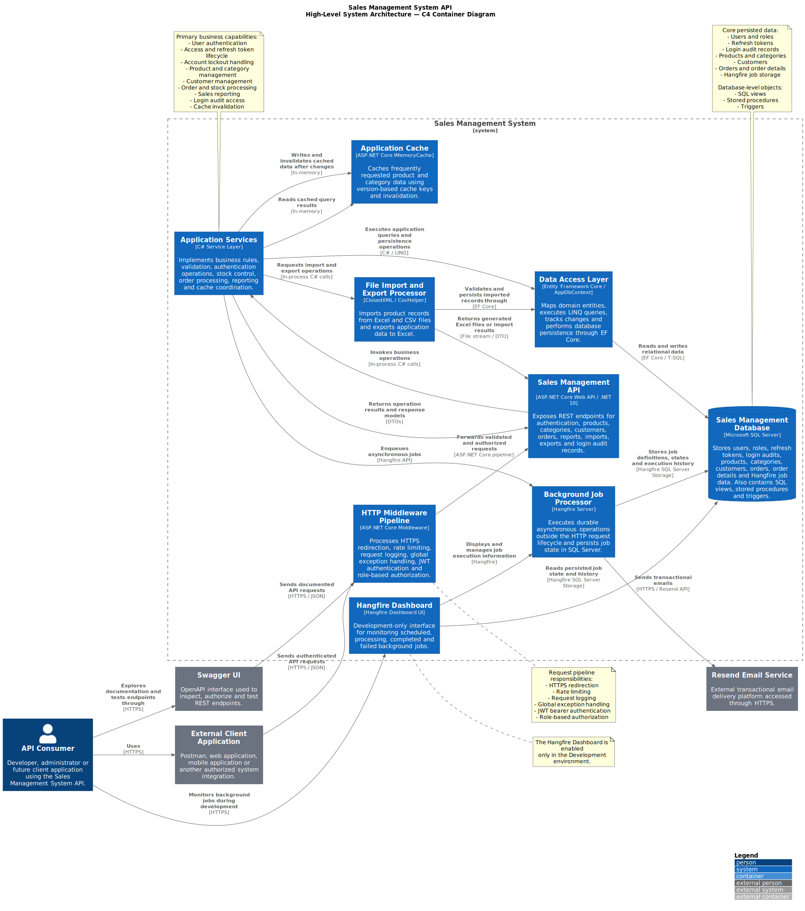
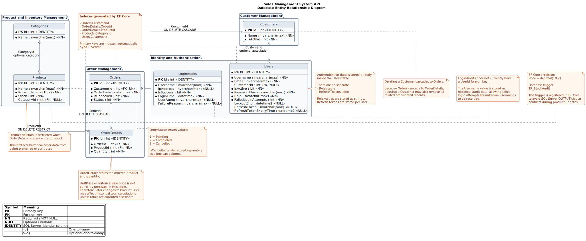
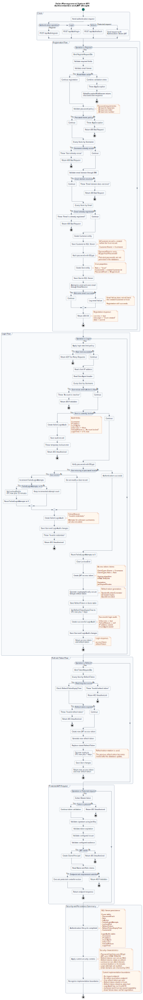
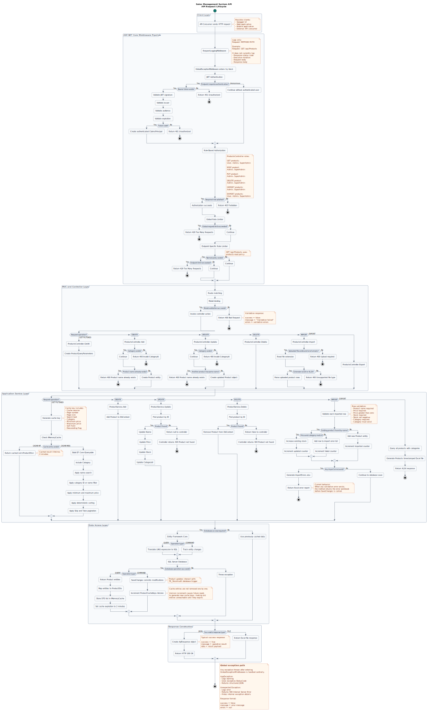
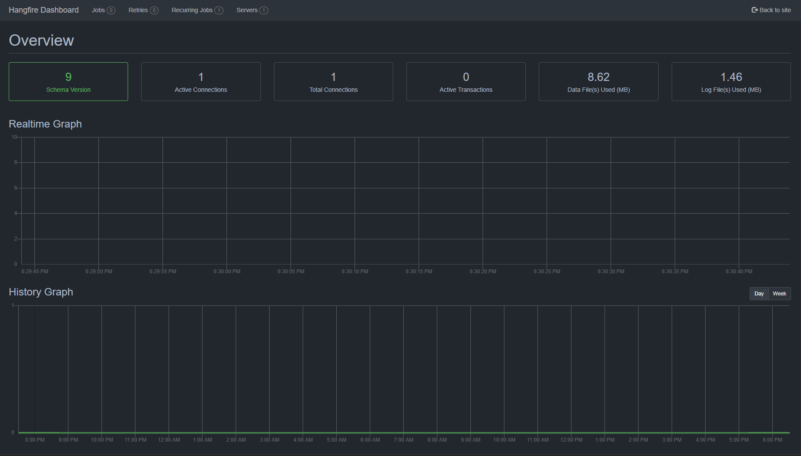
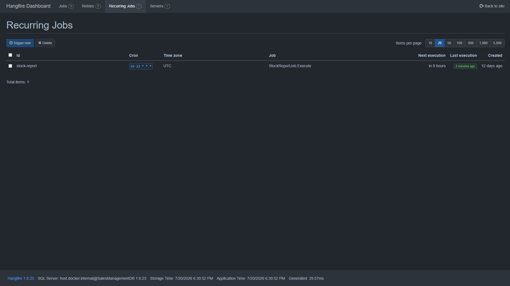
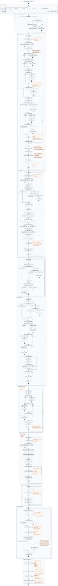
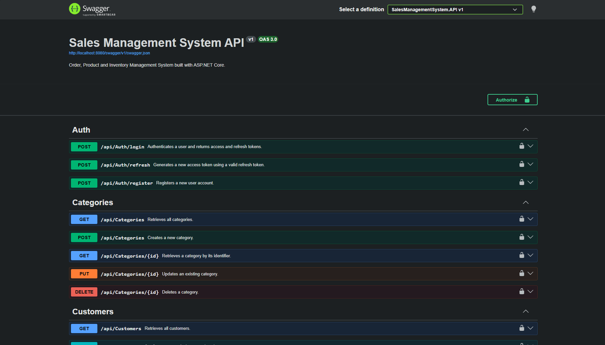
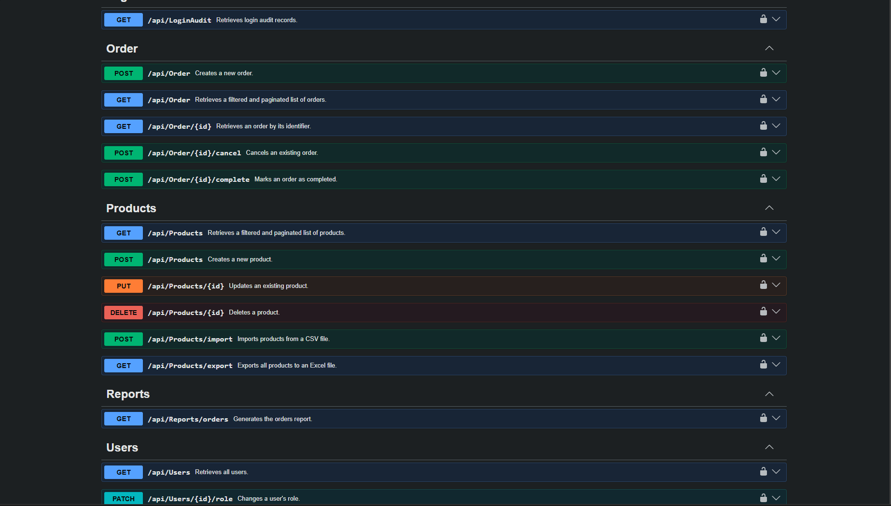

# Sales Management System API

    

A comprehensive **Sales Management System RESTful API** built with
**ASP.NET Core Web API (.NET 10)** during my Software Development
Internship at **DBHSoft**.

The project simulates a real-world sales automation system by providing
secure and scalable APIs for managing products, categories, customers,
orders, users and inventory operations.

It demonstrates modern backend development practices including
authentication, authorization, caching, background jobs, reporting,
logging, exception handling, Docker containerization and clean layered
architecture.

------------------------------------------------------------------------

# Project Overview

The primary objective of this project is to design and develop a
production-oriented Sales Management API by applying Microsoft's backend
technologies and modern software engineering principles.

The system focuses on scalability, maintainability and security while
following RESTful API standards.

The project includes:

-   Secure JWT Authentication
-   Role-Based Authorization
-   SQL Server Database Design
-   Entity Framework Core
-   Clean Layered Architecture
-   Product & Inventory Management
-   Customer Management
-   Order Management
-   Reporting
-   Background Jobs
-   Excel & CSV Import / Export
-   Email Notifications
-   Request Logging
-   Global Exception Handling
-   Docker Support

------------------------------------------------------------------------

# Main Features

## Authentication & Security

-   JWT Authentication
-   Refresh Token Authentication
-   BCrypt Password Hashing
-   Role-Based Authorization
-   Account Lockout Protection
-   Login Audit Logging
-   Login Rate Limiting
-   Email Domain Validation
-   Welcome Email Integration (Resend)
-   Secure Password Storage

------------------------------------------------------------------------

## Product Management

-   Product CRUD Operations
-   Product Search
-   Pagination
-   Dynamic Filtering
-   Sorting
-   Category Relationship
-   Memory Cache Support
-   Excel Import
-   Excel Export
-   CSV Import
-   Validation During Import
-   Duplicate Product Detection

------------------------------------------------------------------------

## Category Management

-   Category CRUD Operations
-   Category Validation
-   Product Relationship Management

------------------------------------------------------------------------

## Customer Management

-   Customer CRUD Operations
-   Customer Status Management
-   Customer-User Relationship

------------------------------------------------------------------------

## Order Management

-   Order CRUD Operations
-   Order Detail Management
-   Order Status Tracking
-   Order Cancellation
-   Automatic Stock Updates

------------------------------------------------------------------------

## User Management

-   User CRUD Operations
-   User Activation / Deactivation
-   Role Management
-   Customer Assignment

------------------------------------------------------------------------

## Reporting

-   Order Summary Reports
-   Sales Reporting
-   SQL View Integration

------------------------------------------------------------------------

## Inventory

-   Automatic Stock Tracking
-   Low Stock Detection
-   Daily Inventory Reports
-   Email Notification for Low Stock Products

------------------------------------------------------------------------

## Background Jobs

Implemented using **Hangfire**

-   Daily Stock Report Job
-   Automatic Email Notifications

------------------------------------------------------------------------

## Logging & Monitoring

-   Request Logging Middleware
-   Login Audit Logs
-   Email Failure Logs
-   Global Exception Middleware

------------------------------------------------------------------------

## Performance

-   In-Memory Caching
-   Optimized Product Queries
-   Pagination
-   Efficient Database Queries
-   Non-clustered index on `Products.Name`
-   Optimized product name lookups and sorting using database indexing

------------------------------------------------------------------------

# Technology Stack

  Category            Technology
  ------------------- --------------------------------
  Backend             ASP.NET Core Web API (.NET 10)
  Language            C#
  Database            Microsoft SQL Server
  ORM                 Entity Framework Core
  Authentication      JWT + Refresh Token
  Password Hashing    BCrypt.Net
  Background Jobs     Hangfire
  Email Service       Resend API
  Excel Processing    ClosedXML
  CSV Processing      CsvHelper
  API Documentation   Swagger (OpenAPI)
  Containerization    Docker
  Version Control     Git & GitHub

------------------------------------------------------------------------

# Project Architecture

The project follows a **Layered Architecture** to ensure
maintainability, scalability and separation of concerns.

## System Architecture Diagram

The following C4-style diagram presents the main components of the
system, their responsibilities and their interactions with external
services.



------------------------------------------------------------------------

## Solution Structure

``` text
SalesManagementSystem
│
├── SalesManagementSystem.API
│   ├── Controllers
│   ├── DTOs
│   ├── Services
│   ├── Middlewares
│   ├── Exceptions
│   ├── Properties
│   └── Program.cs
│
├── SalesManagementSystem.Data
│   ├── AppDbContext
│   └── Migrations
│
├── SalesManagementSystem.Models
│   ├── Entities
│   └── Enums
│
└── Database
    ├── Tables
    ├── Views
    ├── Triggers
    └── Stored Procedures
```

The solution separates business logic, data access and domain models
into independent projects, making the application easier to extend and
maintain.

------------------------------------------------------------------------

# Layer Responsibilities

## API Layer

Responsible for:

-   REST API Endpoints
-   Controllers
-   DTOs
-   Business Services
-   Authentication
-   Authorization
-   Middleware
-   Swagger Configuration
-   Background Jobs
-   Email Services

------------------------------------------------------------------------

## Data Layer

Responsible for:

-   Entity Framework Core
-   DbContext
-   Database Configuration
-   Entity Relationships
-   EF Core Migrations

------------------------------------------------------------------------

## Models Layer

Responsible for:

-   Entity Classes
-   Domain Models
-   Enums
-   Shared Business Objects

------------------------------------------------------------------------

# Database Design

The application uses **Microsoft SQL Server** together with **Entity
Framework Core Code First**.

The database schema has been designed to simulate a real-world sales
automation system.

## Entity Relationship Diagram

The following diagram presents the database entities, primary keys,
foreign keys and relationships used by the application.



------------------------------------------------------------------------

## Database Tables

The current database contains the following entities:

  Table          Description
  -------------- --------------------------------------------------
  Users          Application users and authentication information
  Customers      Customer records
  Categories     Product categories
  Products       Product catalog
  Orders         Customer orders
  OrderDetails   Products belonging to an order
  LoginAudits    Login history and security logs

------------------------------------------------------------------------

## Entity Relationships

The database includes several relational mappings.

  Relationship             Type          Delete Behavior
  ------------------------ ------------- -----------------
  Category → Products      One-to-Many   Default
  Customer → Orders        One-to-Many   Cascade
  Order → OrderDetails     One-to-Many   Cascade
  Product → OrderDetails   One-to-Many   Restrict

The complete relationship structure is shown in the Entity Relationship
Diagram above.

------------------------------------------------------------------------

# SQL Objects

Besides Entity Framework, several SQL objects were implemented manually
to improve reporting and business operations.

------------------------------------------------------------------------

## SQL Views

### Order Summary View

The project contains a SQL View that simplifies reporting operations by
combining multiple tables into a single readable dataset.

Current View:

-   **vw_OrderSummary**

------------------------------------------------------------------------

## SQL Stored Procedures

Stored Procedures are used for reusable reporting logic.

Current Procedure:

-   **GetOrderSummary**

------------------------------------------------------------------------

## SQL Triggers

Database triggers are used for automatic auditing.

Current Trigger:

-   **TR_StockAudit**

The trigger automatically records stock-related changes whenever
inventory data is modified.

------------------------------------------------------------------------

# Entity Framework Core

Entity Framework Core is used as the primary ORM.

Implemented features include:

-   Code First Approach
-   LINQ Queries
-   Entity Relationships
-   Fluent API Configuration
-   Fluent API Index Configuration (`Products.Name`)
-   Database Migrations
-   Dependency Injection
-   Lazy Query Composition

------------------------------------------------------------------------

# Project Statistics

Current project includes:

-   7 Database Tables
-   SQL Views
-   SQL Stored Procedures
-   SQL Triggers
-   Database Indexes
-   100+ Source Files
-   Layered Solution Architecture
-   Entity Framework Core Migrations

------------------------------------------------------------------------

# Authentication & Security

Security was one of the primary focuses during development.

The API implements modern authentication and authorization mechanisms to
provide secure access for different user roles.

Implemented security features include:

-   JWT Authentication
-   Refresh Token Authentication
-   BCrypt Password Hashing
-   Role-Based Authorization
-   Account Lockout Protection
-   Login Rate Limiting
-   Login Audit Logging
-   Email Domain Validation
-   Global Exception Handling
-   Secure Password Storage
-   Environment Variable Configuration
-   User Secrets Support

------------------------------------------------------------------------

## Authentication and JWT Lifecycle

The authentication system supports user registration, login,
access-token generation, refresh-token rotation, role-based
authorization, login auditing and temporary account lockout.



### Authentication Security Controls

-   Passwords are hashed using BCrypt.
-   JWT access tokens are signed using HMAC SHA-256.
-   Refresh tokens are generated using a cryptographically secure
    random-number generator.
-   Refresh tokens are rotated whenever the refresh endpoint is used.
-   Accounts are temporarily locked after five failed login attempts.
-   The lockout period is 15 minutes.
-   Successful and failed login attempts are stored in `LoginAudits`.
-   JWT claims include the username and role.
-   Protected endpoints use role-based authorization.

------------------------------------------------------------------------

# API Modules

The application is divided into several independent modules.

## Authentication

Available operations:

-   Register User
-   Login
-   Refresh Token
-   JWT Authorization
-   Password Hashing
-   Role Validation

------------------------------------------------------------------------

## Products

Implemented features:

-   Create Product
-   Update Product
-   Delete Product
-   Get Product By Id
-   Get All Products
-   Pagination
-   Search
-   Filtering
-   Sorting
-   Category Validation
-   Memory Cache

------------------------------------------------------------------------

## Categories

Implemented features:

-   Create Category
-   Update Category
-   Delete Category
-   Get Category
-   List Categories

------------------------------------------------------------------------

## Customers

Implemented features:

-   Customer CRUD
-   Customer Activation
-   Customer Status Management
-   Customer Assignment

------------------------------------------------------------------------

## Orders

Implemented features:

-   Create Orders
-   Order Details
-   Order Status
-   Order Cancellation
-   Automatic Stock Updates

------------------------------------------------------------------------

## Users

Implemented features:

-   User Management
-   Role Updates
-   User Activation
-   Customer Relationship

------------------------------------------------------------------------

## Reports

Implemented features:

-   Order Reports
-   Sales Reports
-   SQL View Integration

------------------------------------------------------------------------

# Excel & CSV Support

The project supports importing and exporting product data using
Microsoft Excel and CSV files.

------------------------------------------------------------------------

## Excel Import

Implemented validations include:

-   Duplicate Product Detection
-   Invalid Category Detection
-   Empty Required Fields
-   Invalid Prices
-   Negative Stock Validation
-   Data Type Validation
-   Error Reporting

If invalid records are detected, the system automatically generates an
Excel file containing all validation errors.

------------------------------------------------------------------------

## Excel Export

Available features:

-   Export Product List
-   Excel Reporting
-   Backup Ready Files

------------------------------------------------------------------------

## CSV Import

Supported features:

-   Bulk Product Import
-   Validation
-   Error Reporting

------------------------------------------------------------------------

# Caching

To improve performance, the API implements **In-Memory Caching**.

Cached operations include:

-   Product Listing
-   Product Filtering
-   Pagination Results

The cache is automatically invalidated whenever product data changes.

------------------------------------------------------------------------

# Logging

Logging is implemented using custom middleware and database auditing.

Current logging features include:

-   Request Logging Middleware
-   Login Audit Logging
-   Failed Login Logging
-   Email Failure Logging

Example Request Log

    GET /api/products?page=1&pageSize=10

------------------------------------------------------------------------

# Global Exception Handling

A centralized exception middleware ensures consistent API responses.

Implemented features:

-   Custom AppException
-   Global Exception Middleware
-   Standardized Error Responses
-   Validation Error Handling
-   Internal Server Error Handling

Example response:

``` json
{
  "success": false,
  "message": "Product not found."
}
```

------------------------------------------------------------------------

# API Request Lifecycle

Every API request passes through a centralized ASP.NET Core middleware
and authorization pipeline before reaching the relevant controller and
service.

The lifecycle includes request logging, global exception handling, JWT
authentication, role authorization, rate limiting, controller execution,
service processing and database access.



The pipeline is configured in the following order:

1.  Swagger middleware
2.  Request logging middleware
3.  Global exception middleware
4.  JWT authentication
5.  Role-based authorization
6.  Rate limiting
7.  Controller routing
8.  Service and database operations

------------------------------------------------------------------------

# Order Processing and Background Jobs

Order operations are processed synchronously through `OrderService`,
while recurring inventory monitoring is handled asynchronously using
Hangfire.

## Hangfire Dashboard

The Hangfire Dashboard provides monitoring for recurring jobs, execution history and background processing status.

<p align="center">
  
</p>

The order workflow includes authentication, role validation, stock
validation, SQL transactions, order-detail creation, stock deduction,
cancellation-based stock restoration and cache invalidation.

Hangfire executes a recurring low-stock job every day at 23:59 server
time. Products with stock levels below 10 are included in an HTML report
and sent to the configured administrator email address through Resend.

## Scheduled Background Jobs

The project currently schedules recurring background jobs for low-stock reporting.

<p align="center">
  
</p>



## Order Processing

-   Orders are created inside SQL database transactions.
-   Products and requested quantities are validated before saving.
-   Product stock is reduced when an order is created.
-   Failed operations roll back the complete transaction.
-   Cancelling an order restores the related product stock.
-   Completed orders cannot be cancelled.
-   Cancelled orders cannot be completed.
-   Product cache versions are invalidated after stock changes.
-   Standard users can access only their own orders.
-   Administrators can access all orders.

## Hangfire Low Stock Job

-   Job identifier: `stock-report`
-   Schedule: Every day at 23:59
-   Low-stock threshold: Less than 10 units
-   Email provider: Resend
-   Recipient: `Email:AdminEmail`
-   Output: HTML table containing product names and remaining stock

------------------------------------------------------------------------

# Email Integration

The project integrates with **Resend API**.

Current email features:

-   Welcome Email
-   Low Stock Notifications
-   Email Validation
-   Failure Logging

------------------------------------------------------------------------

# API Documentation

Interactive API documentation is provided using Swagger.

## Swagger Interface

The API is fully documented using Swagger (OpenAPI), allowing interactive endpoint testing directly from the browser.

<p align="center">
  
</p>

<p align="center">
  
</p>

Documentation includes:

-   Endpoint Descriptions
-   Request Models
-   Response Models
-   Authentication Support
-   Try-It-Out Interface

Swagger is automatically available when running the application in
Development mode.

------------------------------------------------------------------------

# Technologies

## Backend

-   ASP.NET Core Web API (.NET 10)
-   C#
-   RESTful API

------------------------------------------------------------------------

## Database

-   Microsoft SQL Server
-   Entity Framework Core

------------------------------------------------------------------------

## Authentication

-   JWT Bearer Authentication
-   Refresh Tokens
-   BCrypt.Net

------------------------------------------------------------------------

## Background Jobs

-   Hangfire

------------------------------------------------------------------------

## Email Service

-   Resend API

------------------------------------------------------------------------

## Excel Processing

-   ClosedXML
-   CsvHelper

------------------------------------------------------------------------

## Caching

-   IMemoryCache

------------------------------------------------------------------------

## Documentation

-   Swagger (OpenAPI)
-   XML Comments

------------------------------------------------------------------------

## Containerization

-   Docker
-   Docker Compose

------------------------------------------------------------------------

## Version Control

-   Git
-   GitHub

------------------------------------------------------------------------

# Getting Started

## Clone the Repository

``` bash
git clone https://github.com/EmirhanKaradeniz10/SalesManagementSystem-API.git
```

Move into the project directory.

``` bash
cd SalesManagementSystem-API
```

------------------------------------------------------------------------

# Environment Configuration

The project uses environment variables for sensitive configuration.

Create a `.env` file in the root directory.

Example:

``` env
ConnectionStrings__DefaultConnection=YOUR_CONNECTION_STRING

Jwt__Key=YOUR_SECRET_KEY
Jwt__Issuer=YOUR_ISSUER
Jwt__Audience=YOUR_AUDIENCE

Resend__ApiKey=YOUR_RESEND_API_KEY
```

A sample configuration is already included in:

    .env.example

------------------------------------------------------------------------

# Running with Docker

Build and start the application:

``` bash
docker compose up --build
```

Stop the containers:

``` bash
docker compose down
```

------------------------------------------------------------------------

# Running Locally

Restore packages:

``` bash
dotnet restore
```

Apply database migrations:

``` bash
dotnet ef database update
```

Run the project:

``` bash
dotnet run
```

------------------------------------------------------------------------

# Swagger

After running the application, Swagger UI is available at:

    https://localhost:{PORT}/swagger

Swagger provides:

-   Interactive API Testing
-   Endpoint Documentation
-   Request Models
-   Response Models
-   Authentication Support

------------------------------------------------------------------------

# Future Improvements

Possible future enhancements include:

-   Password Reset via Email
-   Email Verification
-   Redis Distributed Cache
-   Unit Testing
-   Integration Testing
-   CI/CD Pipeline
-   Azure Deployment
-   Kubernetes Support
-   Monitoring with Application Insights
-   Advanced Reporting Dashboard

------------------------------------------------------------------------

# Project Status

Current implementation includes:

-   JWT Authentication
-   Refresh Tokens
-   Role-Based Authorization
-   Product Management
-   Category Management
-   Customer Management
-   Order Management
-   SQL Server Integration
-   Entity Framework Core
-   Background Jobs
-   Email Integration
-   Excel Import / Export
-   Memory Cache
-   Global Exception Handling
-   Request Logging
-   Login Audit Logging
-   Docker Support
-   Swagger Documentation

------------------------------------------------------------------------

# License

This project was developed for educational purposes and as part of my
software development internship at **DBHSoft**.

Feel free to explore, use and modify the source code under the terms of the MIT License.

------------------------------------------------------------------------

# Author

**Emirhan Karadeniz**

Computer Engineering Student

GitHub:

https://github.com/EmirhanKaradeniz10
